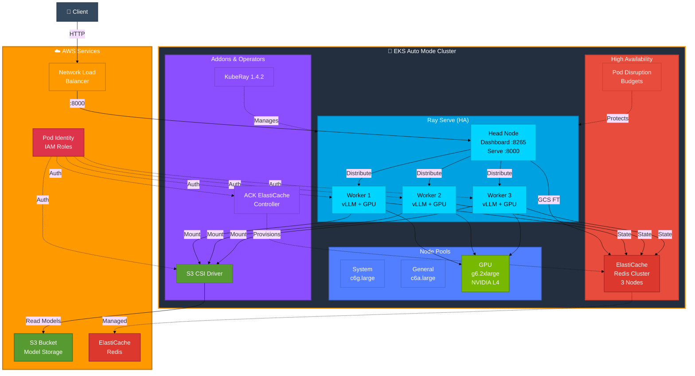

# 🚀 EKS Auto Mode with Ray Serve & vLLM

<div align="center">


</div>

A production-ready deployment of Ray Serve with vLLM 0.11.0 on Amazon EKS Auto Mode, serving LLM models from S3 with GPU acceleration and OpenAI-compatible API endpoints.

> ⚠️ **DISCLAIMER**: This project is provided as a reference example only and should not be used in production environments without proper review, testing, and modifications to meet your specific requirements. The author takes no responsibility for any issues, costs, or damages that may arise from using this code. This repository is maintained on a best-effort basis with no guarantees of support or updates.

## ⚡ Quick Start

**New here?** Check out [QUICKSTART.md](QUICKSTART.md) for a fast-track guide!

```bash
# One-command deployment
./scripts/deploy-ray-service.sh

# Monitor progress
./scripts/monitor-deployment.sh

# Test inference
./scripts/test-inference.sh
```

**Time:** ~45 minutes | **Cost:** ~$1.11/hr

## 📋 Overview

This setup demonstrates:
- **EKS 1.33 Auto Mode** - Fully managed Kubernetes with automatic node provisioning
- **GPU Node Pool** - G6/G6e instances with NVIDIA L4 GPUs
- **Ray Serve 2.51** - Scalable model serving framework with OpenAI-compatible API
- **vLLM 0.11.0** - High-performance LLM inference engine with RunAI streamer
- **S3 CSI Driver** - Mount S3 buckets as volumes for optimized model loading
- **Pod Identity** - Secure AWS IAM integration
- **OpenAI API** - Compatible endpoints for easy integration

## 🏗️ Architecture

### AWS Services Used

<div align="center">

| Service | Purpose |
|---------|---------|
|  | Kubernetes cluster management |
|  | Redis cluster for Ray GCS fault tolerance |
|  | Model storage |
|  | Pod Identity & permissions |
|  | GPU compute (G6/G6e) |
|  | Network Load Balancer for external access |

</div>

### Architecture Diagram

> 💡 **Tip for Presentations**: When viewing on GitHub, click the diagram to see it in full size. For presentations, you can export this diagram using [Mermaid Live Editor](https://mermaid.live/) and adjust font sizes there.



### Component Details

| Component | Type | Purpose |
|-----------|------|---------|
| **Control Plane** | Managed | EKS API server, scheduler, controllers |
| **System Nodes** | c6g.large | Core system pods (CoreDNS, kube-proxy) |
| **General Nodes** | c6a.large | General workloads, operators |
| **GPU Nodes** | g6.2xlarge | Ray workers with NVIDIA L4 GPUs |
| **Ray Head** | Pod | Ray cluster coordinator, dashboard, OpenAI-compatible API endpoint |
| **Ray Workers (3x)** | Pods | vLLM 0.11.0 inference engines with GPU, RunAI streamer, anti-affinity placement |
| **ElastiCache Redis** | Managed | 3-node Redis cluster for Ray GCS fault tolerance |
| **S3 CSI** | Driver | Mounts S3 bucket as volume for model storage |
| **Pod Identity** | IAM | Secure AWS service access without IRSA |
| **ACK Controller** | Operator | Manages ElastiCache resources via Kubernetes CRDs |
| **KubeRay 1.4.2** | Operator | Manages Ray cluster lifecycle and HA configuration |
| **Network Load Balancer** | AWS | External access to Ray Serve API |

## 🎯 Features

✅ **Auto Mode Benefits**
- Automatic node provisioning and scaling
- Managed control plane
- Simplified cluster operations

✅ **GPU Optimization**
- Dedicated GPU node pool with taints
- 2-hour node retention to prevent churn
- Support for G6 and G6e instance families

✅ **Model Serving**
- Ray Serve 2.51 with OpenAI-compatible API
- vLLM 0.11.0 for optimized LLM inference
- RunAI streamer for faster model loading from S3
- S3-backed model storage with PVC mounting
- Pod Identity for secure AWS access

✅ **OpenAI Compatibility**
- `/v1/chat/completions` endpoint
- Compatible with OpenAI Python client
- Streaming support
- Standard request/response format

✅ **High Availability**
- PodDisruptionBudgets for zero-downtime updates
- ElastiCache Redis for Ray GCS fault tolerance
- Rolling update controls with node disruption limits
- Minimum replica guarantees during maintenance

## 📦 Prerequisites

- AWS CLI configured
- `eksctl` installed
- `kubectl` installed
- `helm` installed
- AWS account with appropriate permissions

## 🚀 Quick Start

### Automated Deployment

Use the deployment script for a complete setup:

```bash
./scripts/deploy-ray-service.sh
```

This will automatically:
1. Create EKS cluster (~15-20 min)
2. Deploy KubeRay operator
3. Configure GPU node pool
4. Set up S3 CSI driver
5. Cache model to S3
6. Deploy Ray Serve with HA

**Total Time:** ~45 minutes

### Manual Deployment

Or follow these steps for manual deployment:

### 1. Create EKS Cluster

```bash
eksctl create cluster -f cluster/eks-cluster-config.yaml
```

This creates:
- EKS 1.33 cluster with Auto Mode enabled
- Pod Identity associations

**⏱️ Time: ~15-20 minutes**

### 2. Deploy KubeRay Operator

```bash
helm repo add kuberay https://ray-project.github.io/kuberay-helm/
helm repo update
helm install kuberay-operator kuberay/kuberay-operator \
  --version 1.2.2 \
  --create-namespace \
  --namespace kuberay-system
```

**⏱️ Time: ~30 seconds**

### 3. Configure GPU Node Pool

```bash
kubectl apply -f cluster/gpu-nodepool.yaml
```

This creates a node pool with:
- G6/G6e instance families
- GPU taints (`nvidia.com/gpu:NoSchedule`)
- 2-hour consolidation delay
- On-demand capacity

**⏱️ Time: Instant (nodes provision on-demand)**

### 4. Push Ray 2.51.0 Image to ECR

Cache the Ray 2.51.0 image in your ECR repository for faster pulls:

```bash
# Push Ray 2.51.0 image to ECR
kubectl apply -f app/ecr-push-ray-2.51-image.yaml

# Wait for completion (takes ~1-2 minutes)
kubectl logs -f ecr-push-ray-2-51-image

# Clean up
kubectl delete pod ecr-push-ray-2-51-image
```

This uses `regctl` to copy `rayproject/ray:2.51.0-py311-gpu` from Docker Hub to ECR in us-west-2. The Ray service configurations are already set to use the ECR image.

**⏱️ Time: ~1-2 minutes**

### 5. Install S3 CSI Driver

```bash
# Install as EKS addon
aws eks create-addon \
  --cluster-name my-auto-cluster \
  --addon-name aws-mountpoint-s3-csi-driver \
  --region us-west-2

# Create pod identity association
eksctl create podidentityassociation \
  --cluster my-auto-cluster \
  --namespace kube-system \
  --service-account-name s3-csi-driver-sa \
  --permission-policy-arns arn:aws:iam::aws:policy/AmazonS3FullAccess \
  --region us-west-2
```

**⏱️ Time: ~1 minute**

### 6. Cache Model to S3

```bash
# Create S3 bucket
aws s3 mb s3://qwen-models-$(aws sts get-caller-identity --query Account --output text) --region us-west-2

# Create pod identity for model caching
eksctl create podidentityassociation \
  --cluster my-auto-cluster \
  --namespace default \
  --service-account-name model-cache-sa \
  --permission-policy-arns arn:aws:iam::aws:policy/AmazonS3FullAccess \
  --region us-west-2

# Cache model
kubectl apply -f app/cache-model-job.yaml
```

This downloads `Qwen/Qwen2.5-0.5B-Instruct` from Hugging Face and uploads to S3.

**⏱️ Time: ~2-3 minutes**

### 7. Deploy ElastiCache Redis with ACK (Optional but Recommended)

For production deployments, use managed ElastiCache instead of in-cluster Redis:

```bash
# Install ACK ElastiCache Controller
./scripts/install-ack-elasticache.sh

# Deploy ElastiCache Redis cluster (3-node, Multi-AZ)
./scripts/deploy-elasticache.sh
```

This creates:
- 3-node Redis cluster with automatic failover
- Multi-AZ deployment for high availability
- Encryption at rest
- Automated backups and maintenance windows
- Security group with VPC-only access

**⏱️ Time: ~15 minutes (ElastiCache provisioning)**

**Benefits over in-cluster Redis**:
- ✅ Fully managed by AWS (no maintenance overhead)
- ✅ Automatic failover and recovery
- ✅ Automated backups and point-in-time recovery
- ✅ Better performance and reliability
- ✅ Separate from EKS cluster lifecycle

**Note**: The Ray Service configuration (`app/ray-serve-vllm-ha.yaml`) is already configured to use ElastiCache. If you skip this step, you can deploy in-cluster Redis by uncommenting the Redis StatefulSet section in the YAML.

### 8. Deploy Ray Serve with vLLM 0.11.0 (High Availability)

```bash
# Apply with environment variable substitution for AWS account ID
export AWS_ACCOUNT_ID=$(aws sts get-caller-identity --query Account --output text)
cat app/ray-serve-vllm-v0.11.yaml | envsubst | kubectl apply -f -
```

This deploys:
- Ray 2.51.0 with vLLM 0.11.0
- OpenAI-compatible API endpoints
- 3 Ray GPU workers with RunAI streamer for optimized model loading
- PodDisruptionBudgets for zero-downtime upgrades
- Service endpoints on port 8000 (`/v1/chat/completions`)
- Integration with ElastiCache for GCS fault tolerance

**⏱️ Time: ~5-7 minutes (includes model loading)**

**Features**:
- ✅ **vLLM 0.11.0** with RunAI streamer for faster model loading
- ✅ **OpenAI-compatible API** at `/v1/chat/completions`
- ✅ Zero-downtime cluster upgrades
- ✅ 3 Ray workers with anti-affinity (spread across nodes)
- ✅ ElastiCache Redis for Ray GCS fault tolerance
- ✅ PodDisruptionBudgets (minAvailable: 2 workers, 1 head)
- ✅ Graceful shutdown with preStop hooks
- ✅ Health checks (readiness/liveness probes)
- ✅ S3 model loading with RunAI streamer optimization

**Note**: For legacy deployment with vLLM 0.6.3, use `app/ray-serve-vllm-ha.yaml` instead.

### 9. Expose External Access (Optional)

Deploy a Network Load Balancer for external API access:

```bash
kubectl apply -f app/ray-serve-nlb.yaml
```

Get the external endpoint:
```bash
kubectl get svc vllm-serve-nlb -o jsonpath='{.status.loadBalancer.ingress[0].hostname}'
```

**⏱️ Time: ~2 minutes**

### 10. Test Inference

Test via internal service with OpenAI-compatible API:
```bash
kubectl run test-inference --rm -it --restart=Never \
  --image=curlimages/curl:latest -- \
  curl -X POST http://vllm-serve-nbfp4-head-svc:8000/v1/chat/completions \
  -H "Content-Type: application/json" \
  -H "Authorization: Bearer fake-key" \
  -d '{
    "model": "qwen-0.5b",
    "messages": [{"role": "user", "content": "What is the capital of France?"}],
    "max_tokens": 100
  }'
```

Or test via external NLB (if deployed):
```bash
NLB_ENDPOINT=$(kubectl get svc ray-serve-nlb -o jsonpath='{.status.loadBalancer.ingress[0].hostname}')
curl -X POST http://$NLB_ENDPOINT/v1/chat/completions \
  -H "Content-Type: application/json" \
  -H "Authorization: Bearer fake-key" \
  -d '{
    "model": "qwen-0.5b",
    "messages": [{"role": "user", "content": "What is the capital of France?"}],
    "max_tokens": 100
  }'
```

Expected output (OpenAI format):
```json
{
  "id": "chatcmpl-79db9869-f362-4bfd-bf32-708110404185",
  "object": "chat.completion",
  "created": 1762151002,
  "model": "qwen-0.5b",
  "choices": [{
    "index": 0,
    "message": {
      "role": "assistant",
      "content": "The capital of France is Paris.",
      "refusal": null
    },
    "finish_reason": "stop"
  }],
  "usage": {
    "prompt_tokens": 36,
    "total_tokens": 44,
    "completion_tokens": 8
  }
}
```

**Using Python OpenAI Client:**
```python
from openai import OpenAI

# Initialize client
client = OpenAI(
    base_url="http://vllm-serve-nbfp4-head-svc:8000/v1",
    api_key="fake-key"
)

# Chat completion
response = client.chat.completions.create(
    model="qwen-0.5b",
    messages=[{"role": "user", "content": "What is the capital of France?"}],
    max_tokens=100
)

print(response.choices[0].message.content)
```

**⏱️ Time: ~5-7 minutes first request (model loading with RunAI streamer), ~1-2 seconds subsequent requests**

**Note**: The first request to each worker takes longer as it loads the model into GPU memory using RunAI streamer for optimized loading. Subsequent requests are much faster.

## 🔄 Zero-Downtime Cluster Upgrades

### Problem

During EKS cluster upgrades (e.g., 1.33 → 1.34), nodes are replaced with new AMI versions. Without proper configuration, this causes downtime because:

1. **Insufficient PDB Coverage**: Only workers had PDB, not the head node
2. **No Health Checks**: Kubernetes couldn't determine when pods were ready
3. **No Graceful Shutdown**: Pods terminated immediately, dropping in-flight requests
4. **Pod Placement**: Workers could be on the same node, causing multiple failures
5. **Node Disruption**: Karpenter could disrupt nodes without respecting pod readiness

### Solution: High Availability Configuration

Use `app/ray-serve-vllm-ha.yaml` instead of `app/ray-serve-vllm.yaml` for zero-downtime upgrades.

#### Key Improvements

**1. Increased Replicas (1 → 3 workers)**
- With 3 workers and PDB requiring 2 available, you can always lose 1 worker during upgrades
- Provides buffer for rolling updates

**2. Pod Disruption Budgets for Head, Workers, and Redis**
- Head PDB: `minAvailable: 1` - ensures head node stays up
- Worker PDB: `minAvailable: 2` - ensures at least 2 workers available during disruptions
- Redis PDB: `minAvailable: 2` - ensures at least 2 Redis instances available for fault tolerance

**3. Health Checks**
- Readiness probes ensure traffic only goes to ready pods
- Liveness probes detect and restart unhealthy pods
- Head uses HTTP checks on Ray dashboard API
- Workers use `ray health-check` command

**4. Graceful Shutdown**
- 60s termination grace period
- preStop hooks drain workers gracefully: `ray stop --grace-period 30`
- Allows in-flight requests to complete

**5. Pod Anti-Affinity**
- Forces workers onto separate nodes
- Ensures single node failure only affects one worker
- Uses `topologySpreadConstraints` for even distribution

**6. Karpenter Disruption Control**
- `expireAfter: Never` - respects PDBs indefinitely
- `budgets: nodes: "1"` - only disrupts one node at a time

#### Deployment

```bash
# Deploy HA configuration (includes Redis + Ray Service)
./scripts/apply-with-envsubst.sh app/ray-serve-vllm-ha.yaml

# Verify all components
kubectl get pods -l app=redis
kubectl get pods -l ray.io/cluster

# Verify PDBs
kubectl get pdb
# Should show:
# redis-pdb              2         N/A             0                     1s
# vllm-serve-head-pdb    1         N/A             0                     1s
# vllm-serve-worker-pdb  2         N/A             0                     1s

# Verify pod distribution (workers should be on different nodes)
kubectl get pods -l ray.io/cluster -o wide
```

**ElastiCache Redis Configuration**:
- 3-node Redis cluster with automatic failover (Multi-AZ)
- Managed by AWS ElastiCache service
- Deployed via ACK (AWS Controllers for Kubernetes)
- Ray connects via `gcsFaultToleranceOptions.redisAddress`
- Encryption at rest enabled
- Automated backups with 5-day retention
- Separate from EKS cluster lifecycle (survives cluster deletion)
- No in-cluster Redis overhead (CPU/memory savings)

#### Testing Upgrade Simulation

```bash
# Cordon a node to simulate upgrade
NODE=$(kubectl get nodes -l karpenter.sh/nodepool=gpu-nodepool -o jsonpath='{.items[0].metadata.name}')
kubectl cordon $NODE
kubectl drain $NODE --ignore-daemonsets --delete-emptydir-data

# Monitor - service should remain available
kubectl get pods -w

# In another terminal, continuously test availability
while true; do
  curl -s http://vllm-serve-head-svc:8000/health || echo "FAILED"
  sleep 1
done
```

#### Upgrade Process Flow

**Before (With Downtime)**
1. EKS upgrade triggers AMI update
2. Karpenter marks nodes as drifted
3. Both worker nodes drain simultaneously
4. All workers terminate → **DOWNTIME**
5. New nodes provision
6. Workers restart

**After (Zero Downtime)**
1. EKS upgrade triggers AMI update
2. Karpenter marks nodes as drifted
3. Karpenter attempts to drain Node 1
4. PDB allows (3 workers - 1 = 2 remaining ≥ minAvailable)
5. Worker 1 receives SIGTERM → preStop hook runs
6. Worker 1 drains gracefully (30s)
7. Worker 1 terminates
8. New node provisions → new worker starts
9. New worker passes readiness probe
10. **Only then** does Karpenter drain Node 2
11. Process repeats for remaining workers

#### Cost Considerations

**Before**: 1 workers = 1 × g6.2xlarge  
**After**: 3 workers = 3 × g6.2xlarge  
**Additional Cost**: ~50% increase (1 extra GPU node)  
**Benefit**: Zero downtime during upgrades, better fault tolerance

**Cost Optimization Options**:
- Scale to 3 workers only during maintenance windows
- Use Spot instances for the 3rd worker
- Use scheduled scaling (scale up before upgrades, scale down after)

#### Troubleshooting

**PDB Blocks All Disruptions**
- Symptom: `kubectl drain` hangs indefinitely
- Cause: Not enough replicas to satisfy minAvailable
- Solution: Temporarily increase replicas or adjust PDB

**Pods Stuck in Terminating**
- Symptom: Pods don't terminate after 60s
- Cause: preStop hook or application not responding
- Solution: Check pod logs, increase terminationGracePeriodSeconds

**Workers on Same Node**
- Symptom: Multiple workers scheduled on one node
- Cause: Not enough nodes or anti-affinity not working
- Solution: Check node count, force reschedule with `kubectl delete pod -l ray.io/group-name=gpu-workers`

## 📊 Monitoring & Observability

### Quick Health Checks

Check Ray Serve status:
```bash
kubectl exec -it $(kubectl get pod -l ray.io/node-type=head -o name) -- serve status
```

View Ray Dashboard:
```bash
kubectl port-forward svc/vllm-serve-head-svc 8265:8265
```
Open http://localhost:8265

Check GPU utilization:
```bash
kubectl exec -it $(kubectl get pod -l ray.io/group-name=gpu-workers -o name) -- nvidia-smi
```

### Production Monitoring Stack

Deploy comprehensive monitoring with Prometheus, Grafana, and GPU metrics:

#### 1. Install Prometheus Stack

```bash
helm repo add prometheus-community https://prometheus-community.github.io/helm-charts
helm repo update

helm install prometheus prometheus-community/kube-prometheus-stack \
  --namespace monitoring \
  --create-namespace \
  --set prometheus.prometheusSpec.serviceMonitorSelectorNilUsesHelmValues=false \
  --set prometheus.prometheusSpec.podMonitorSelectorNilUsesHelmValues=false
```

**⏱️ Time: ~2 minutes**

#### 2. Deploy DCGM GPU Exporter

```bash
helm repo add gpu-helm-charts https://nvidia.github.io/gpu-helm-charts
helm install dcgm-exporter gpu-helm-charts/dcgm-exporter \
  --namespace monitoring \
  --values monitoring/dcgm-values.yaml
```

**⏱️ Time: ~1 minute**

#### 3. Configure Ray Serve Monitoring

```bash
kubectl apply -f monitoring/prometheus-monitoring.yaml
```

This creates ServiceMonitors for Ray head and worker metrics.

**⏱️ Time: Instant**

#### 4. Deploy Grafana Dashboards

```bash
# Ray Serve dashboard
kubectl apply -f monitoring/ray-serve-enhanced-dashboard.yaml

# GPU metrics dashboard
kubectl apply -f monitoring/gpu-dashboard-configmap.yaml
```

**⏱️ Time: Instant**

#### 5. Access Grafana

```bash
kubectl port-forward -n monitoring svc/prometheus-grafana 3000:80
```

Login credentials:
- Username: `admin`
- Password: `prom-operator`

Open http://localhost:3000 and navigate to Dashboards.

### Key Metrics to Monitor

#### Ray Serve Metrics

| Metric | Description | Alert Threshold |
|--------|-------------|-----------------|
| `ray_serve_num_http_requests` | Total HTTP requests | - |
| `ray_serve_request_latency_ms` | Request latency (P95) | > 5000ms |
| `ray_serve_deployment_replica_healthy` | Healthy replicas | < 1 |
| `ray_serve_deployment_queued_queries` | Queued requests | > 100 |
| `ray_serve_num_deployment_http_error_requests` | Failed requests | > 10/min |

#### GPU Metrics (DCGM)

| Metric | Description | Alert Threshold |
|--------|-------------|-----------------|
| `DCGM_FI_DEV_GPU_UTIL` | GPU utilization % | > 95% sustained |
| `DCGM_FI_DEV_FB_USED` | GPU memory used | > 90% |
| `DCGM_FI_DEV_GPU_TEMP` | GPU temperature | > 80°C |
| `DCGM_FI_DEV_POWER_USAGE` | Power consumption | > 250W |

#### vLLM Metrics

| Metric | Description | Alert Threshold |
|--------|-------------|-----------------|
| `vllm:num_requests_running` | Active requests | - |
| `vllm:num_requests_waiting` | Queued requests | > 50 |
| `vllm:gpu_cache_usage_perc` | KV cache usage | > 90% |
| `vllm:time_to_first_token_seconds` | TTFT latency | > 2s |
| `vllm:time_per_output_token_seconds` | Token generation speed | > 0.1s |

### Grafana Dashboards

The deployment includes two pre-configured dashboards:

**Ray Serve Dashboard** (`ray-serve-enhanced-dashboard.yaml`)
- Request rate and latency trends
- Replica health and scaling
- Error rates and queue depth
- Resource utilization

**GPU Metrics Dashboard** (`gpu-dashboard-configmap.yaml`)
- GPU utilization and memory
- Temperature and power consumption
- Per-GPU breakdown
- Historical trends

### Alerting

Create alert rules for critical conditions:

```bash
kubectl apply -f - <<EOF
apiVersion: monitoring.coreos.com/v1
kind: PrometheusRule
metadata:
  name: ray-serve-alerts
  namespace: default
spec:
  groups:
  - name: ray-serve
    interval: 30s
    rules:
    - alert: RayServeHighLatency
      expr: histogram_quantile(0.95, rate(ray_serve_request_latency_ms_bucket[5m])) > 5000
      for: 5m
      labels:
        severity: warning
      annotations:
        summary: "High Ray Serve latency detected"
        description: "P95 latency is {{ \$value }}ms"
    
    - alert: RayServeReplicaDown
      expr: ray_serve_deployment_replica_healthy < 1
      for: 2m
      labels:
        severity: critical
      annotations:
        summary: "Ray Serve deployment has no healthy replicas"
    
    - alert: HighGPUMemoryUsage
      expr: (DCGM_FI_DEV_FB_USED / DCGM_FI_DEV_FB_TOTAL) > 0.9
      for: 5m
      labels:
        severity: warning
      annotations:
        summary: "GPU memory usage above 90%"
    
    - alert: HighGPUTemperature
      expr: DCGM_FI_DEV_GPU_TEMP > 80
      for: 5m
      labels:
        severity: warning
      annotations:
        summary: "GPU temperature above 80°C"
EOF
```

### Troubleshooting Monitoring

**Metrics not appearing:**
```bash
# Check metrics endpoint
kubectl port-forward svc/vllm-serve-head-svc 8080:8080
curl http://localhost:8080/metrics

# Verify ServiceMonitors
kubectl get servicemonitor
kubectl describe servicemonitor ray-head-monitor

# Check Prometheus targets (in Prometheus UI)
# Status → Targets → look for ray-head-monitor
```

**DCGM exporter issues:**
```bash
# Check DCGM pods
kubectl get pods -n monitoring -l app.kubernetes.io/name=dcgm-exporter

# View logs
kubectl logs -n monitoring -l app.kubernetes.io/name=dcgm-exporter

# Verify GPU nodes have DCGM
kubectl exec -it $(kubectl get pod -l ray.io/group-name=gpu-workers -o name) -- nvidia-smi
```

**Grafana dashboard not loading:**
```bash
# Check if ConfigMaps are created
kubectl get configmap -l grafana_dashboard=1

# Restart Grafana to reload dashboards
kubectl rollout restart deployment -n monitoring prometheus-grafana
```

## 🔧 Configuration

### Adjust GPU Node Pool

Edit `cluster/gpu-nodepool.yaml`:

```yaml
spec:
  disruption:
    consolidateAfter: 2h  # Change retention time
  template:
    spec:
      requirements:
        - key: eks.amazonaws.com/instance-family
          values:
            - g6    # Add/remove instance families
            - g6e
```

### Change Model

Edit `app/ray-serve-vllm.yaml` ConfigMap:

```python
model_path = "/s3/models/YOUR-ORG/YOUR-MODEL"
```

And update `app/cache-model-job.yaml`:

```bash
export MODEL_NAME="YOUR-ORG/YOUR-MODEL"
```

### Scale Ray Workers

Edit `app/ray-serve-vllm.yaml`:

```yaml
workerGroupSpecs:
- replicas: 2  # Increase for more workers
  minReplicas: 1
  maxReplicas: 5
```

## 🧹 Cleanup

### Remove Application Components

```bash
# Delete Ray Serve HA deployment
kubectl delete -f app/ray-serve-vllm-ha.yaml

# Or delete basic deployment
kubectl delete -f app/ray-serve-vllm.yaml

# Delete ElastiCache resources (if deployed via ACK)
kubectl delete -f app/elasticache-redis.yaml

# Delete optional components
kubectl delete -f app/ray-serve-nlb.yaml
kubectl delete -f app/cache-model-job.yaml

# Delete monitoring resources (if deployed)
kubectl delete -f monitoring/prometheus-monitoring.yaml
kubectl delete -f monitoring/ray-serve-enhanced-dashboard.yaml
kubectl delete -f monitoring/gpu-dashboard-configmap.yaml
```

### Uninstall Helm Charts

```bash
# Remove monitoring stack
helm uninstall prometheus -n monitoring
helm uninstall dcgm-exporter -n monitoring

# Remove KubeRay operator
helm uninstall kuberay-operator -n kuberay-system

# Delete namespaces
kubectl delete namespace monitoring
kubectl delete namespace kuberay-system
```

### Delete S3 Resources

```bash
# Get your account ID
ACCOUNT_ID=$(aws sts get-caller-identity --query Account --output text)

# Empty and delete S3 bucket
aws s3 rm s3://qwen-models-$ACCOUNT_ID --recursive
aws s3 rb s3://qwen-models-$ACCOUNT_ID
```

### Delete EKS Cluster

```bash
# Delete GPU node pool first
kubectl delete -f cluster/gpu-nodepool.yaml

# Wait for nodes to terminate (check EC2 console)
# Then delete the cluster
eksctl delete cluster -f cluster/eks-cluster-config.yaml
```

**⏱️ Time: ~10-15 minutes**

### Verify Cleanup

```bash
# Check no EKS clusters remain
aws eks list-clusters --region us-west-2

# Check no S3 buckets remain
aws s3 ls | grep qwen-models

# Check CloudFormation stacks are deleted
aws cloudformation list-stacks --region us-west-2 \
  --stack-status-filter DELETE_IN_PROGRESS DELETE_COMPLETE
```

## 🐛 Troubleshooting

### GPU Nodes Not Provisioning

Check node pool status:
```bash
kubectl get nodepool gpu-nodepool
kubectl describe nodepool gpu-nodepool
```

Verify GPU capacity in region:
```bash
aws ec2 describe-instance-type-offerings \
  --location-type availability-zone \
  --filters Name=instance-type,Values=g6.2xlarge \
  --region us-west-2
```

Check for pending pods:
```bash
kubectl get pods -A | grep Pending
kubectl describe pod <pending-pod-name>
```

### Ray Serve Not Starting

Check serve status:
```bash
kubectl exec -it $(kubectl get pod -l ray.io/node-type=head -o name) -- serve status
```

View detailed logs:
```bash
# Head node logs
kubectl logs -l ray.io/node-type=head --tail=100 -f

# Worker logs
kubectl logs -l ray.io/group-name=gpu-workers --tail=100 -f

# Check for errors in all Ray pods
kubectl get pods -l ray.io/cluster=vllm-serve
```

Common issues:
- **OOMKilled**: Increase memory limits in `ray-serve-vllm.yaml`
- **ImagePullBackOff**: Check image availability and pull secrets
- **CrashLoopBackOff**: Review logs for Python errors or missing dependencies

### S3 Mount Issues

Verify CSI driver is running:
```bash
kubectl get pods -n kube-system -l app.kubernetes.io/name=aws-mountpoint-s3-csi-driver
```

Check PVC and PV status:
```bash
kubectl get pvc,pv
kubectl describe pvc s3-pvc
```

Test S3 access from pod:
```bash
kubectl run s3-test --rm -it --restart=Never \
  --image=amazon/aws-cli \
  --serviceaccount=model-cache-sa -- \
  s3 ls s3://qwen-models-$(aws sts get-caller-identity --query Account --output text)/
```

Common issues:
- **Pending PVC**: Check CSI driver logs and pod identity association
- **Mount failed**: Verify S3 bucket exists and IAM permissions are correct
- **Access denied**: Ensure pod identity association is created for the correct service account

### Model Loading Errors

Check worker logs for model loading:
```bash
kubectl logs -l ray.io/group-name=gpu-workers --tail=200 | grep -i "model\|error\|exception"
```

Verify model files in S3:
```bash
ACCOUNT_ID=$(aws sts get-caller-identity --query Account --output text)
aws s3 ls s3://qwen-models-$ACCOUNT_ID/models/Qwen/Qwen2.5-0.5B-Instruct/ --recursive
```

Test model loading manually:
```bash
kubectl exec -it $(kubectl get pod -l ray.io/group-name=gpu-workers -o name) -- \
  python -c "from transformers import AutoTokenizer; AutoTokenizer.from_pretrained('/s3/models/Qwen/Qwen2.5-0.5B-Instruct')"
```

Common issues:
- **Model not found**: Re-run `cache-model-job.yaml` to download model
- **Out of memory**: Model too large for GPU, try smaller model or larger instance
- **Slow loading**: First load downloads from S3, subsequent loads use cache

### Network Load Balancer Issues

Check NLB status:
```bash
kubectl get svc vllm-serve-nlb
kubectl describe svc vllm-serve-nlb
```

Verify target health:
```bash
# Get load balancer ARN from AWS console or CLI
aws elbv2 describe-target-health \
  --target-group-arn <target-group-arn> \
  --region us-west-2
```

Test connectivity:
```bash
# From within cluster
kubectl run test --rm -it --restart=Never --image=curlimages/curl:latest -- \
  curl -v http://vllm-serve-head-svc:8000/health

# From external (after NLB is ready)
NLB_ENDPOINT=$(kubectl get svc vllm-serve-nlb -o jsonpath='{.status.loadBalancer.ingress[0].hostname}')
curl -v http://$NLB_ENDPOINT:8000/health
```

Common issues:
- **Targets unhealthy**: Check pod readiness and health endpoint
- **Connection timeout**: Verify security groups allow traffic on port 8000
- **DNS not resolving**: Wait 2-3 minutes for DNS propagation

### High Availability Issues

Check Redis status:
```bash
kubectl get pods -l app=redis
kubectl logs -l app=redis --tail=50
```

Verify Ray GCS connection:
```bash
kubectl exec -it $(kubectl get pod -l ray.io/node-type=head -o name) -- \
  ray status
```

Test Redis connectivity:
```bash
kubectl run redis-test --rm -it --restart=Never --image=redis:7-alpine -- \
  redis-cli -h redis-0.redis.default.svc.cluster.local ping
```

Check PodDisruptionBudget status:
```bash
kubectl get pdb
kubectl describe pdb vllm-serve-worker-pdb
```

Common issues:
- **Pods evicted during drain**: PDB ensures minimum replicas, but check if minAvailable is set correctly
- **Redis connection failures**: Verify Redis pods are running and service DNS is resolving
- **Ray GCS errors**: Check if external storage is configured in RayCluster spec

### Performance Issues

Check resource utilization:
```bash
# GPU utilization
kubectl exec -it $(kubectl get pod -l ray.io/group-name=gpu-workers -o name) -- nvidia-smi

# Pod resources
kubectl top pods

# Node resources
kubectl top nodes
```

Review metrics in Grafana:
```bash
kubectl port-forward -n monitoring svc/prometheus-grafana 3000:80
# Open http://localhost:3000 and check dashboards
```

Common issues:
- **High latency**: Scale up replicas or use larger GPU instances
- **GPU underutilized**: Increase batch size or concurrent requests
- **Memory pressure**: Reduce KV cache size or model size

## 📚 Resources

### AWS Documentation
- [EKS Auto Mode Documentation](https://docs.aws.amazon.com/eks/latest/userguide/automode.html)
- [EKS Pod Identity](https://docs.aws.amazon.com/eks/latest/userguide/pod-identities.html)
- [Mountpoint for S3 CSI Driver](https://github.com/awslabs/mountpoint-s3-csi-driver)

### Ray & ML Serving
- [Ray Serve Documentation](https://docs.ray.io/en/latest/serve/index.html)
- [Ray Metrics & Monitoring](https://docs.ray.io/en/latest/ray-observability/ray-metrics.html)
- [KubeRay Documentation](https://docs.ray.io/en/latest/cluster/kubernetes/index.html)
- [vLLM Documentation](https://docs.vllm.ai/)
- [vLLM Metrics](https://docs.vllm.ai/en/latest/serving/metrics.html)

### Monitoring & Observability
- [Prometheus Operator](https://prometheus-operator.dev/)
- [Grafana Dashboards](https://grafana.com/docs/grafana/latest/dashboards/)
- [DCGM Exporter](https://github.com/NVIDIA/dcgm-exporter)
- [Kube Prometheus Stack](https://github.com/prometheus-community/helm-charts/tree/main/charts/kube-prometheus-stack)

### GPU & Kubernetes
- [NVIDIA GPU Operator](https://docs.nvidia.com/datacenter/cloud-native/gpu-operator/latest/)
- [Karpenter Node Pools](https://karpenter.sh/docs/concepts/nodepools/)
- [EKS GPU AMIs](https://docs.aws.amazon.com/eks/latest/userguide/eks-optimized-ami.html)

## 📝 Project Structure

```
.
├── cluster/              # EKS cluster configuration
│   ├── eks-cluster-config.yaml
│   ├── gpu-nodepool.yaml
│   └── ebs-csi-storageclass.yaml
├── app/                  # Application deployments
│   ├── cache-model-job.yaml
│   ├── ecr-push-image.yaml
│   ├── ray-serve-vllm.yaml         # Basic Ray Serve deployment
│   ├── ray-serve-vllm-ha.yaml      # HA deployment with Redis + zero-downtime upgrades
│   ├── redis-ha.yaml               # Standalone Redis (if needed separately)
│   └── ray-serve-nlb.yaml
├── monitoring/           # Observability stack
│   ├── prometheus-monitoring.yaml
│   ├── dcgm-values.yaml
│   ├── ray-serve-enhanced-dashboard.yaml
│   ├── gpu-dashboard-configmap.yaml
│   ├── grafana-dashboard-configmap.yaml
│   └── ray-grafana-dashboard.json
├── load-test/           # K6 load testing
│   ├── k6-load-test.js
│   ├── k6-deployment.yaml
│   └── k6-job.yaml
└── scripts/             # Helper scripts
    ├── README.md                   # Scripts documentation
    ├── deploy-ray-service.sh       # Automated deployment
    ├── check-deployment-status.sh  # Quick status check
    ├── monitor-deployment.sh       # Continuous monitoring
    ├── test-inference.sh           # Test inference endpoint
    ├── check-gpu-utilization.sh    # GPU metrics
    ├── view-ray-dashboard.sh       # Port-forward to dashboard
    └── cleanup.sh                  # Complete cleanup
```

## 🛠️ Helper Scripts

All helper scripts are located in the `scripts/` directory.

| Script | Purpose | Size |
|--------|---------|------|
| `deploy-ray-service.sh` | Automated full deployment | 3.9K |
| `check-deployment-status.sh` | Quick status check | 1.2K |
| `monitor-deployment.sh` | Continuous monitoring | 3.1K |
| `test-inference.sh` | Test inference endpoint | 633B |
| `check-gpu-utilization.sh` | GPU metrics | 756B |
| `view-ray-dashboard.sh` | Port-forward to dashboard | 629B |
| `cleanup.sh` | Complete cleanup | 1.5K |

**Documentation:**
- [scripts/README.md](scripts/README.md) - Detailed guide
- [scripts/CHEATSHEET.md](scripts/CHEATSHEET.md) - Quick reference

## 🧪 Load Testing

### Quick Start

Run a 60-minute load test to validate performance:

```bash
# Deploy K6 load test
kubectl apply -f load-test/k6-deployment.yaml
kubectl apply -f load-test/k6-job.yaml

# Watch progress
kubectl logs -f job/k6-load-test
```

### Load Profile

- **Duration**: 60 minutes
- **Ramp up**: 2 minutes to 15 concurrent users
- **Sustained load**: 55 minutes at 15 VUs
- **Cool down**: 3 minutes

### Expected Results (2x g6.2xlarge)

- **Throughput**: 5-10 requests/second
- **Latency P95**: 3-5 seconds
- **GPU Utilization**: 70-85%
- **Error Rate**: < 1%

### Monitoring

View real-time metrics in Grafana:
```bash
kubectl port-forward -n monitoring svc/prometheus-grafana 3000:80
# Open http://localhost:3000 (admin / prom-operator)
```

Check GPU utilization:
```bash
kubectl exec -it $(kubectl get pod -l ray.io/cluster=vllm-serve -o name | grep worker | head -1) -- nvidia-smi
```

### Adjusting Load

Edit `load-test/k6-deployment.yaml` to change VUs or duration:
```javascript
stages: [
  { duration: '2m', target: 20 },  // More load
  { duration: '55m', target: 20 },
  { duration: '3m', target: 0 },
]
```

### Cleanup

```bash
kubectl delete job k6-load-test
kubectl delete deployment k6-load-test
kubectl delete configmap k6-script
kubectl delete svc k6-web-ui
```

## 🎓 What You Learned

1. ✅ Setting up EKS Auto Mode with GPU support
2. ✅ Configuring Karpenter node pools for GPU workloads
3. ✅ Using Pod Identity for secure AWS access
4. ✅ Mounting S3 buckets with CSI driver
5. ✅ Deploying Ray Serve for production ML serving
6. ✅ Running vLLM for optimized LLM inference
7. ✅ Implementing high availability with PodDisruptionBudgets
8. ✅ Load testing with K6 and monitoring with Grafana

## 🤝 Contributing

Feel free to open issues or submit PRs for improvements!

## 📄 License

MIT License - feel free to use this for your projects!

---

**Built with ❤️ using EKS Auto Mode, Ray, and vLLM**
